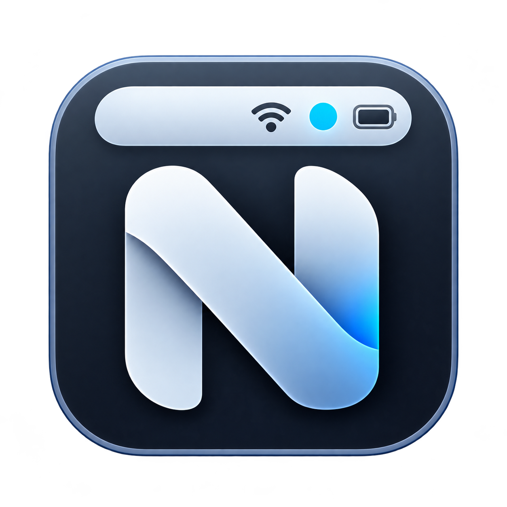

<p align="center">
  
</p>

# NexaBar

**Your Mac. One glance away.**

NexaBar is a native macOS menu-bar utility combining real-time hardware monitoring, per-application audio mixing, clipboard history (text & images), and system shortcuts into a single sleek menu-bar application.

---

## 🌟 Key Features

- **📊 Hardware System Monitor**: Real-time CPU usage, Memory usage, SSD Storage, CPU Temperature (via SMC sensors), and Network Download/Upload rates.
- **🔊 Per-App Audio Mixer**: Individual volume controls for running applications (Brave, Chrome, Discord, Spotify, Teams, etc.) using macOS CoreAudio process taps (`AudioHardwareCreateProcessTap`) and device switching.
- **🎧 Device Output Selector**: Instantly switch output between AirPods, Speakers, HDMI, or HiFi DACs with one click.
- **📋 Rich Clipboard History**: Persistent text & image history with thumbnail previews, 8-hour auto-retention, and global `Cmd + Shift + V` hotkey toggle.
- **📸 Screenshot Capture**: Quick interactive area selection straight to clipboard and history.
- **⚙️ Dynamic Status Bar Layouts**: Monospaced fixed-width single-line text formatting (Compact, Balanced, Full) preventing menu bar jumping or wrapping.

---

## 📦 Building & Packaging

NexaBar is built using Swift Package Manager.

### Local Development

```bash
# Run locally from Terminal
swift run NexaBar
```

### Create Release DMG Installer

To build the standalone `.app` bundle and generate `NexaBar.dmg`:

```bash
chmod +x ./scripts/build_dmg.sh
./scripts/build_dmg.sh
```

Output installer generated at:
```text
/Users/asif/Downloads/NexaBar/NexaBar.dmg
```

---

## 🔒 Permissions & Security

- **Screen & System Audio Recording (`kTCCServiceAudioCapture`)**: Required for per-app audio tapping on macOS 14.2+. Enable in **System Settings → Privacy & Security → Screen & System Audio Recording → NexaBar**.
- **Accessibility**: Optional for global shortcut detection (`Cmd + Shift + V`).

---

## 🛠 Tech Stack

- **Language**: Swift 5.10 / macOS SDK 14+
- **UI Framework**: Native AppKit + SwiftUI
- **Audio Engine**: CoreAudio (Process Taps, Private Aggregate Devices, IOProcs)
- **Persistence**: UserDefaults + Local PNG disk store in `~/.nexabar/clipboard_images/`

---

## 📜 License

NexaBar Pro © 2026. All rights reserved.
